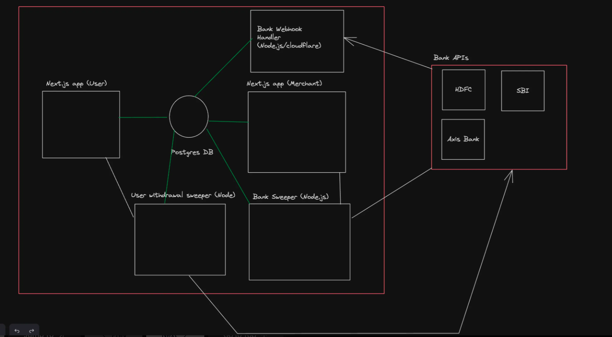

# PAYTM - Digital Payment Platform

## 🚀 Overview
**Paytm** is a comprehensive digital payment platform designed to provide secure and seamless financial transactions for both users and merchants. The application supports features like user authentication, bank transactions, QR code payments, and merchant-specific operations, making it a versatile tool for financial management.

Although this project lacks advanced features like a robust QR code system and cutting-edge authentication mechanisms, it serves as an excellent starting point for learning on-ramping, webhooks, and various other concepts. Future updates will focus on enhancing authentication methods, improving the UI/UX, and adding more functionality.

This project is structured as a **Turborepo**, leveraging a monorepo architecture to manage multiple interconnected packages efficiently.

---

## 🏗️ High-Level Design



### 🔑 **Auth Provider**
- **Secure Authentication**: Users can sign in via email or phone number.
- **Google Login for Merchants**: Facilitates easy access for merchants.

### 🗄️ **Database**
- **Postgres**: Relational database to store structured data.
- **Prisma ORM**: Simplifies interactions with the database.

### 🖥️ **Backend Stack**
- **Next.js**: Full-stack framework handling server-side rendering and backend logic.
- **Express.js**: Auxiliary backend used for specific tasks and additional APIs.

### 🌐 **Frontend Stack**
- **Next.js**: Seamlessly integrates frontend and backend for better performance.
- **Tailwind CSS**: A utility-first CSS framework used for building responsive and customizable UIs.

### 🧩 **Modules**
- **Common**: Shared utilities and services across the app.
- **UI**: Frontend components and design system elements.
- **Backend**: Core server logic and API functionalities.

### ☁️ **Cloud Deployment**
- Hosted on a scalable cloud provider for optimal performance and availability.

---

## 🛠️ Low-Level Design (LLD)

### **Database Schema**
A comprehensive schema designed to handle user accounts, merchant transactions, and financial data flow.

### **Route Signatures**
RESTful APIs with structured routes ensure smooth communication between frontend and backend.

### **Frontend Components**
A well-organized set of components providing an intuitive and interactive user experience.

---

## ✨ Features

### **User Features**
- **Login**: Supports sign-in via email/phone.
- **On-Ramp and Off-Ramp**: Bank transfers to/from user accounts.
- **P2P Transfers**: Peer-to-peer transfers via phone number or name.
- **QR Code Payments**: Users can make payments by scanning merchant-generated QR codes.

### **Merchant Features**
- **Google Login**: Enables quick merchant authentication.
- **QR Code Generation**: Merchants can generate their own QR codes for receiving payments.
- **Notifications & Alerts**: Merchants receive alerts for new payments and transaction updates.
- **Automated Bank Transfers**: Every 2 days, merchant balances are transferred to their bank accounts.

---

## ⚙️ Stack

- **Frontend & Backend**: Next.js
- **Auxiliary Backend**: Express.js
- **Monorepo Management**: Turborepo
- **Database**: Postgres
- **ORM**: Prisma
- **Styling**: Tailwind CSS

---

## 🛤️ Critical Paths

1. **Sending Money**: Streamlined peer-to-peer (P2P) transaction flow.
2. **Merchant Withdrawals**: Ensures timely transfer of merchant funds to their bank accounts.
3. **User Withdrawals**: Facilitates user withdrawals back to their bank accounts.
4. **Bank Webhooks**: Handles money transfers from banks via webhooks for real-time updates.

---

## 🔄 Hot Path Workflow

### **Webhooks**
- **Definition**: Webhooks are HTTP callbacks triggered by specific events (like bank transfers). They allow for real-time updates within the application, ensuring smooth data synchronization.
  
### **Workflow in Paytm**:
1. When a user clicks the "Send Money" button, a new entry is created in the `onRampTransactions` table.
2. Bank webhook events process and update the transaction status accordingly.
3. Once the transaction is complete, users can transfer money to other wallets or bank accounts.

---

## 💻 Sample Code
```javascript
import express from "express";
import db from "@repo/db/client";
const app = express();

app.use(express.json());

app.post("/hdfcWebhook", async (req, res) => {
    // TODO: Add zod validation here?
    // TODO: HDFC bank should ideally send us a secret so we know this is sent by them
    const paymentInformation = {
        token: req.body.token,
        userId: req.body.user_identifier,
        amount: req.body.amount
    };

    try {
        await db.$transaction([
            db.balance.updateMany({
                where: {
                    userId: Number(paymentInformation.userId)
                },
                data: {
                    amount: {
                        increment: Number(paymentInformation.amount)
                    }
                }
            }),
            db.onRampTransaction.updateMany({
                where: {
                    token: paymentInformation.token
                }, 
                data: {
                    status: "Success",
                }
            })
        ]);

        res.json({
            message: "Captured"
        });
    } catch (e) {
        console.error(e);
        res.status(411).json({
            message: "Error while processing webhook"
        });
    }
});

app.listen(3003);
```

---

## Sample Transaction Code
```javascript
const initiateTransaction = async (userId, amount, targetAccount) => {
  try {
    // Create a new transaction entry
    const transaction = await prisma.onRampTransactions.create({
      data: {
        userId,
        amount,
        targetAccount,
        status: 'PENDING',
      },
    });

    // Simulate webhook callback for transaction completion
    setTimeout(async () => {
      await prisma.onRampTransactions.update({
        where: { id: transaction.id },
        data: { status: 'COMPLETED' },
      });
      console.log('Transaction completed successfully');
    }, 5000);

    return transaction;
  } catch (error) {
    console.error('Transaction initiation failed:', error);
    throw new Error('Failed to initiate transaction');
  }
};

module.exports = { initiateTransaction };
```

---

## Installation and Setup

### Step 1: Clone the Repository
```bash
git clone <repository-url>
```

### Step 2: Install Dependencies
```bash
npm install
```

### Step 3: Run Postgres Locally or on Cloud
- **Local**:
```bash
docker run -e POSTGRES_PASSWORD=mysecretpassword -d -p 5432:5432 postgres
```
- **Cloud**:
  Use services like [neon.tech](https://neon.tech) to host your database.

### Step 4: Configure Environment Variables
- Copy all `.env.example` files to `.env` in their respective directories.
- Update `.env` files with the correct database URL.

### Step 5: Database Migration and Seeding
```bash
cd packages/db
npx prisma migrate dev
npx prisma db seed
```

### Step 6: Run the Application
- Navigate to the user app directory:
```bash
cd apps/user-app
npm run dev
```

### Step 7: Test the Application
- Login using the following credentials:
  - **Phone**: `1111111111`
  - **Password**: `alice` (see `seed.ts` for details)

---

## Additional Notes
### ER Diagrams
- **Optional**: Useful for visualizing database relationships.

### Feature Planning
- Features are driven by product requirements.
- Balances simplicity and efficiency to avoid technical debt.

### Scalability
- Designed to grow with user needs and business demands, supporting high availability and performance.

---

## Future Enhancements
- Improve authentication mechanisms.
- Enhance UI/UX for better usability.
- Add advanced features to streamline operations further.

